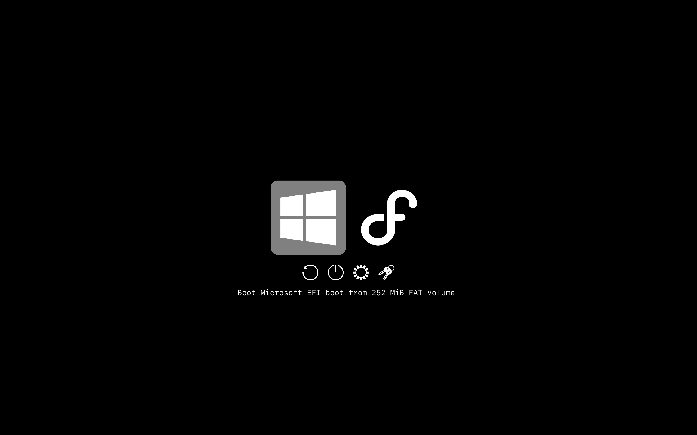

# refind-tobor

Minimalistic dark theme with icon generation script for [rEFInd](http://www.rodsbooks.com/refind/).


### Installation

 1. Locate the rEFInd EFI directory. This is usually `/boot/efi/EFI/refind`.
    ```cd /boot/efi/EFI/refind/```

 2. Create a directory called `themes` inside it, if it doesn't already exist.
    ```mkdir -p themes```

 3. Clone this repository.
    ```git clone https://github.com/teobsn/refind-tobor```

 4. Move the `refind-tobor` directory from this repository into the `themes` directory.
    ```mv refind-tobor/refind-tobor themes/```

 5. To use the theme add `include themes/refind-tobor/theme.conf` to rEFInd's configuration file
    ```nano refind.conf```

 6. (Optional) Remove repository leftovers.
    ```rm -r refind-tobor/```

### Generator script
This repository contains a `generate.sh` script in the `Scripts/` directory.
The script automatically generates `.png` icons of a desired resolution using source files (`.svg` or `.png`) in the `Source/` directory.
The script automatically (un)crops the images by adding a transparent border. This can be configured, and is meant as a means of adding padding to icons.

The resolution (output size) of the icons can also be configured.
This is useful if you don't want rEFInd to scale icons, but rather render icons in a pixel perfect manner.
By default, the icons provided in the repository are exactly 2x (per dimension, 4x total) bigger in resolution (512px, 128px) than the option specified in the theme's config file (256px, 64px), so that the icon size in the theme's config file can be changed without significantly impacting visual clarity, and without the user needing to invoke the generator script.

## Screenshots

